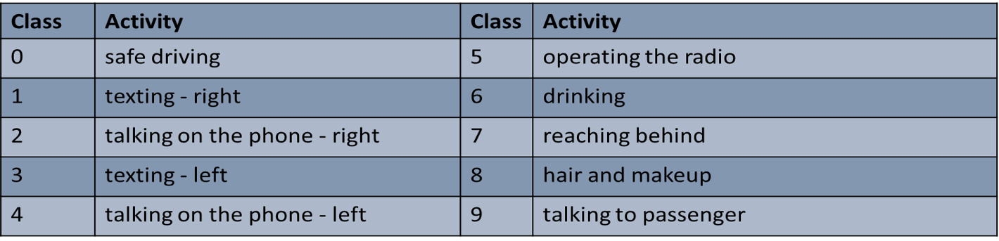

# Distracted Driver Detection

<ul>
<li>We aim to better road safety by preventing distracted driving.</li>
 
<li>We propose a standalone hardware IOT unit, which could be attached to the passenger side of the car.</li>

<li>The IOT unit(raspberry pi 3b+) runs a deep learning model which continuously classifies the driver images (captured via an inbuilt camera) into one of the 10 classes.</li>

<li> Should distracted driving be detected, a buzzer will go off, alerting the driver (and passengers) of unsafe driving.
</li>`

</ul>

## Have a look.

